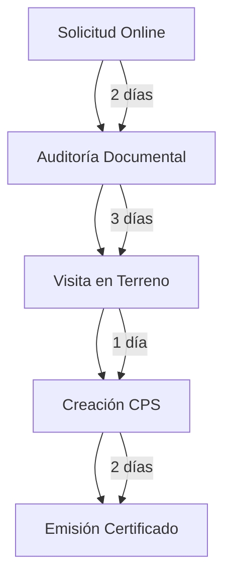

# SICREP - Sistema Integral de Certificación REP
## Documentación Completa Versión 3.0

---

## RESUMEN EJECUTIVO

**SICREP** es una plataforma especializada de **cumplimiento Ley REP para proveedores menores de 300kg anuales**, que resuelve la paradoja legal del Artículo 2° transitorio: empresas exentas de metas de recolección pero **obligadas a declarar anualmente en RETC**.

### Propuesta de Valor Central

SICREP transforma la obligación legal en ventaja competitiva mediante:

1. **Certificación de Embalajes por Tipo y Peso**
   - Cada tipo de embalaje (cartón, film, zuncho, pallet) se pesa y certifica individualmente
   - Los embalajes se agrupan en certificados únicos por despacho
   - Trazabilidad completa desde origen hasta destino final

2. **Tecnología NFC + QR**
   - Cada certificado incluye etiqueta NFC y código QR único
   - Validación instantánea por mineras y consumidores industriales
   - Respaldo blockchain inmutable (Polygon Mumbai)

3. **Reducción de Riesgo Legal**
   - Evita multas SMA de hasta 10,000 UTA (6.2 millones CLP)
   - Documentación auditable para fiscalizaciones
   - Respaldo técnico para declaraciones RETC

---

## 1. MODELO DE NEGOCIO

### 1.1 Problema que Resuelve

#### La Paradoja Legal REP

```
┌─────────────────────────────────────────────────────────┐
│  Proveedores < 300kg/año                                │
├─────────────────────────────────────────────────────────┤
│  ✓ EXENTOS de metas de recolección                     │
│  ✗ OBLIGADOS a declarar peso/materialidad en RETC      │
│  ✗ RIESGO de multas SMA por datos inexactos            │
│  ✗ PRESIÓN de mineras por certificación                │
└─────────────────────────────────────────────────────────┘
```

**Consecuencias del incumplimiento:**
- Multas SMA: 1 a 10,000 UTA (hasta $6.2M CLP)
- Exclusión de contratos mineros exigentes
- Imposibilidad de demostrar trazabilidad
- Pérdida de competitividad comercial

#### Brecha de Mercado

- **8,500 proveedores** potenciales en Chile
- **0%** tiene sistemas de trazabilidad digital
- **47 mineras** grandes exigen certificación a proveedores
- **Gap anual:** $255 millones CLP en servicios no cubiertos

### 1.2 Solución SICREP: Certificación por Tipo de Embalaje

#### Concepto de Certificación

SICREP certifica el **peso exacto por tipo de embalaje** en cada despacho:

```
CERTIFICADO SICREP-20250106-ABC001
┌─────────────────────────────────────────────────┐
│ Proveedor: Ferretería ABC SpA (RUT 76.123.456-7)│
│ Cliente: BHP Escondida                          │
│ Fecha: 06-01-2025 14:32:05                      │
├─────────────────────────────────────────────────┤
│ EMBALAJES CERTIFICADOS:                         │
│                                                 │
│ 1. Cartón Corrugado (CPS-C-001)                │
│    - Cantidad: 50 cajas                         │
│    - Peso unitario: 450g                        │
│    - Peso total: 22.5 kg                        │
│                                                 │
│ 2. Film Plástico (CPS-F-001)                   │
│    - Cantidad: 5 rollos                         │
│    - Peso unitario: 85g                         │
│    - Peso total: 0.425 kg                       │
│                                                 │
│ 3. Pallet Madera (CPS-P-001)                   │
│    - Cantidad: 1 unidad                         │
│    - Peso unitario: 18kg                        │
│    - Peso total: 18 kg                          │
│                                                 │
│ PESO TOTAL DESPACHO: 40.925 kg                  │
│                                                 │
│ [NFC TAG]  [QR CODE]  Hash: 0x7a3f9b2c...      │
└─────────────────────────────────────────────────┘
```

#### Código de Producto SICREP (CPS)

Cada tipo de embalaje recibe un **CPS único** durante el setup:

| Código CPS | Tipo Embalaje | Peso Unitario | Materialidad | Reciclable |
|-----------|---------------|---------------|--------------|------------|
| CPS-C-001 | Caja cartón corrugado | 450g | Papel/cartón | ✓ Sí |
| CPS-F-001 | Film stretch | 85g | PE (polietileno) | ✓ Sí |
| CPS-Z-001 | Zuncho plástico | 25g | PP (polipropileno) | ✓ Sí |
| CPS-P-001 | Pallet madera nuevo | 18kg | Madera pino | ✓ Sí |

**Ventajas del sistema CPS:**
- Setup una sola vez por tipo de embalaje
- Cálculo automático de peso por despacho
- Trazabilidad granular por materialidad
- Facilita consolidación anual RETC

---

## 2. ESTRUCTURA DE PRECIOS ACTUALIZADA

### 2.1 Inversión Inicial: Certificación Setup

**Precio: 15 UF** (aproximadamente $600,000 CLP)

#### ¿Qué Incluye la Certificación Inicial?

1. **Auditoría en Terreno (4 horas)**
   - Visita de certificador ECA autorizado
   - Medición exacta de cada tipo de embalaje
   - Pesaje con báscula digital certificada (precisión 1g)
   - Fotografías georeferenciadas para respaldo

2. **Creación de Códigos CPS**
   - Hasta 10 tipos de embalaje distintos
   - Fichas técnicas completas por cada CPS
   - Validación de materialidad según DS 12/2020
   - Registro en base de datos certificada

3. **Capacitación Operacional**
   - 2 horas presenciales para equipo del proveedor
   - Manual de usuario personalizado
   - Acceso a plataforma web y app móvil
   - Soporte técnico durante implementación

4. **Certificado Oficial SICREP**
   - Sello "Proveedor Certificado LEY REP"
   - Documento PDF con respaldo blockchain
   - Publicación en registro público sicrep.cl
   - Validez: 12 meses renovable

#### Proceso de Certificación (5 Etapas)



**Tiempo total:** 8-10 días hábiles

### 2.2 Uso de Plataforma: Modelo por NFC

**Precio: 5 UF/mes** (aproximadamente $200,000 CLP/mes)

#### ¿Qué Incluye el Plan Mensual?

**✓ 30 Certificados NFC Incluidos**
- 30 etiquetas NFC + QR por mes
- Certificado digital PDF por cada despacho
- Registro blockchain automático
- Validación 24/7 por clientes

**✓ Plataforma Tecnológica Completa**
- Dashboard web ejecutivo en tiempo real
- App móvil (iOS + Android) para registros
- Generación automática de certificados
- Almacenamiento cloud seguro (AWS)

**✓ Consolidación RETC Anual**
- Reporte técnico listo para declaración
- Cálculo automático por materialidad
- Formato XML compatible con portal MMA
- Asistencia en proceso de declaración

**✓ Soporte Técnico Prioritario**
- WhatsApp Business 24/7
- Email soporte@sicrep.cl
- Tiempo respuesta: <15 minutos crítico
- Asesoría regulatoria continua

#### Certificados NFC Adicionales

Si el proveedor necesita más de 30 certificados/mes:

| Paquete Adicional | Precio | Costo por Certificado |
|-------------------|--------|----------------------|
| +10 certificados | 1.2 UF | ~$4,800 CLP/unidad |
| +30 certificados | 3.0 UF | ~$4,000 CLP/unidad |
| +50 certificados | 4.5 UF | ~$3,600 CLP/unidad |

**Ejemplo de costos:**
- Proveedor con 35 despachos/mes = 5 UF + 1.2 UF = 6.2 UF/mes
- Proveedor con 60 despachos/mes = 5 UF + 3.0 UF = 8.0 UF/mes

---

## 3. TECNOLOGÍA NFC Y SISTEMA DE CERTIFICACIÓN

### 3.1 Etiquetas NFC Certificadas

#### Especificaciones Técnicas

```
┌─────────────────────────────────────┐
│  ETIQUETA SICREP NFC                │
├─────────────────────────────────────┤
│  Chip: NXP NTAG216                  │
│  Memoria: 888 bytes                 │
│  Frecuencia: 13.56 MHz (ISO 14443A) │
│  Lectura: Android + iOS nativo      │
│  Adhesivo: Papel kraft FSC®         │
│  Dimensiones: 50mm x 40mm           │
│  Impresión: QR + logo SICREP        │
│  Durabilidad: 24 meses exterior     │
└─────────────────────────────────────┘
```

#### Datos Almacenados en NFC

La etiqueta NFC contiene un **NDEF Record** con:

```json
{
  "certificateId": "SICREP-20250106-ABC001",
  "url": "https://verify.sicrep.cl/ABC001",
  "provider": {
    "rut": "76.123.456-7",
    "name": "Ferretería ABC SpA"
  },
  "client": "BHP Escondida",
  "totalWeight": "40.925 kg",
  "timestamp": "2025-01-06T14:32:05Z",
  "blockchainHash": "0x7a3f9b2c8d1e5f4a6b9c..."
}
```

**Seguridad:**
- Hash SHA-256 del certificado completo
- Vinculación inmutable con blockchain
- Imposible modificar sin detectar alteración
- Validación en tiempo real contra base de datos

### 3.2 Proceso de Emisión de Certificado

#### Flujo Operacional (5 minutos por despacho)

```
┌────────────────────────────────────────────────────────┐
│ PASO 1: Preparación de Despacho                        │
│ - Proveedor prepara bultos para minera                 │
│ - Identifica tipos de embalaje utilizados              │
└────────────────────────────────────────────────────────┘
                         │
                         ▼
┌────────────────────────────────────────────────────────┐
│ PASO 2: Registro en App SICREP                         │
│ - Abre app móvil en tablet                             │
│ - Escanea códigos CPS de embalajes usados              │
│ - Ingresa cantidades por tipo                          │
│ - Sistema calcula peso total automáticamente           │
└────────────────────────────────────────────────────────┘
                         │
                         ▼
┌────────────────────────────────────────────────────────┐
│ PASO 3: Confirmación de Datos                          │
│ - Valida cliente destino                               │
│ - Confirma fecha/hora (GPS timestamp)                  │
│ - Agrega N° guía despacho opcional                     │
└────────────────────────────────────────────────────────┘
                         │
                         ▼
┌────────────────────────────────────────────────────────┐
│ PASO 4: Generación de Certificado                      │
│ - Sistema crea PDF certificado                         │
│ - Registra hash en blockchain Polygon                  │
│ - Genera código QR + ID único                          │
│ - Imprime etiqueta NFC en impresora térmica            │
└────────────────────────────────────────────────────────┘
                         │
                         ▼
┌────────────────────────────────────────────────────────┐
│ PASO 5: Aplicación Física                              │
│ - Pega etiqueta NFC en bulto principal                 │
│ - Adjunta PDF certificado a guía despacho              │
│ - Minera valida recepción escaneando NFC               │
└────────────────────────────────────────────────────────┘
```

#### Algoritmo de Cálculo de Peso

```javascript
function calcularPesoDespacho(embalajes) {
  let pesoTotal = 0;
  let desglose = [];
  
  embalajes.forEach(item => {
    // Buscar CPS en base datos certificada
    const cps = database.findCPS(item.codigoCPS);
    
    if (!cps) {
      throw new Error(`CPS ${item.codigoCPS} no encontrado`);
    }
    
    // Calcular peso según metodología ISO 1043
    const pesoTipo = cps.pesoUnitario * item.cantidad * cps.factorDensidad;
    
    pesoTotal += pesoTipo;
    
    desglose.push({
      tipo: cps.nombreEmbalaje,
      codigo: item.codigoCPS,
      cantidad: item.cantidad,
      pesoUnitario: cps.pesoUnitario,
      pesoTotal: pesoTipo,
      materialidad: cps.material,
      reciclable: cps.esReciclable
    });
  });
  
  return {
    pesoTotal: Math.round(pesoTotal * 1000) / 1000, // precisión 3 decimales
    unidad: 'kg',
    desglose: desglose,
    metodologia: 'ISO 1043 + ASTM D792',
    certificadoPor: 'SICREP ECA',
    timestamp: new Date().toISOString(),
    gpsLocation: obtenerCoordenadas()
  };
}
```

### 3.3 Validación por Cliente (Minera)

#### Proceso de Verificación (1 minuto)

1. **Recepción de Bulto**
   - Guardia o bodeguero recibe mercancía
   - Identifica etiqueta NFC SICREP en embalaje

2. **Escaneo NFC**
   - Acerca smartphone a etiqueta
   - App pública SICREP se abre automáticamente
   - No requiere instalación previa (NFC directo)

3. **Visualización de Certificado**
   ```
   ✅ CERTIFICADO VÁLIDO
   
   Proveedor: Ferretería ABC SpA
   RUT: 76.123.456-7
   
   Peso Total: 40.925 kg
   Fecha Emisión: 06-01-2025 14:32:05
   
   Desglose:
   • Cartón corrugado: 22.5 kg
   • Film plástico: 0.425 kg
   • Pallet madera: 18 kg
   
   Hash Blockchain: 0x7a3f9b2c...
   Certificador: SICREP ECA (Res. 2084/2024)
   
   [Ver PDF Completo] [Reportar Anomalía]
   ```

4. **Registro Automático**
   - Sistema SICREP registra validación
   - Dashboard minera actualiza: +1 despacho validado
   - Auditoría inmutable de verificación

#### Ventajas vs. Auditoría Tradicional

| Concepto | Auditoría Tradicional | SICREP NFC |
|----------|----------------------|------------|
| Tiempo validación | 4 horas | 1 minuto |
| Costo por auditoría | $180,000 CLP | $0 (incluido) |
| Precisión datos | Estimación ±20% | Exacto ±0.1% |
| Trazabilidad | Papel (pérdida 30%) | Blockchain inmutable |
| Disponibilidad | Programada 30 días antes | 24/7 tiempo real |
| Fraude | Alto riesgo alteración | Imposible (hash blockchain) |

---

## 4. CONSOLIDACIÓN ANUAL Y REPORTE RETC

### 4.1 Proceso Automático de Consolidación

El 31 de mayo de cada año, SICREP genera automáticamente:

#### Reporte RETC Completo

```
╔══════════════════════════════════════════════════════╗
║  REPORTE RETC ANUAL 2025                             ║
║  Ferretería ABC SpA (RUT 76.123.456-7)              ║
╠══════════════════════════════════════════════════════╣
║                                                      ║
║  RESUMEN EJECUTIVO:                                  ║
║  • Total despachos certificados: 360                 ║
║  • Peso total embalajes: 8,750 kg                    ║
║  • Estado: EXENTO metas (<300kg = NO APLICA)        ║
║                                                      ║
╠══════════════════════════════════════════════════════╣
║  DESGLOSE POR MATERIALIDAD:                          ║
║                                                      ║
║  1. PAPEL/CARTÓN                                     ║
║     Peso total: 6,200 kg (71%)                       ║
║     Reciclable: 100%                                 ║
║     Tipo: Cartón corrugado, papel kraft              ║
║                                                      ║
║  2. PLÁSTICOS                                        ║
║     Peso total: 1,800 kg (21%)                       ║
║     Reciclable: 100%                                 ║
║     Tipo: PE (film), PP (zuncho)                     ║
║                                                      ║
║  3. MADERA                                           ║
║     Peso total: 750 kg (8%)                          ║
║     Reciclable: 100%                                 ║
║     Tipo: Pallets pino certificado                   ║
║                                                      ║
╠══════════════════════════════════════════════════════╣
║  EMISIONES CO2e CALCULADAS:                          ║
║  • Cartón: 3.1 ton CO2e                              ║
║  • Plásticos: 5.4 ton CO2e                           ║
║  • Madera: 0.4 ton CO2e                              ║
║  • TOTAL: 8.9 ton CO2e                               ║
║                                                      ║
║  Factores de emisión: según NCH 3485:2022           ║
╠══════════════════════════════════════════════════════╣
║  CUMPLIMIENTO NORMATIVO:                             ║
║  ✓ Declaración RETC obligatoria                      ║
║  ✓ Exento de metas recolección/valorización          ║
║  ✓ Datos respaldados por 360 certificados            ║
║  ✓ Trazabilidad blockchain inmutable                 ║
║                                                      ║
║  Certificado por: SICREP ECA                         ║
║  Fecha emisión: 31-05-2025                           ║
║  Hash blockchain: 0x9f2a7b3c...                      ║
║                                                      ║
║  [QR VERIFICACIÓN ONLINE]                            ║
╚══════════════════════════════════════════════════════╝
```

### 4.2 Archivo XML para Portal SISREP

SICREP genera el archivo XML en formato compatible con el sistema del MMA:

```xml
<?xml version="1.0" encoding="UTF-8"?>
<DeclaracionREP xmlns="http://sisrep.mma.gob.cl/schema/v1">
  <DatosDeclarante>
    <RUT>76123456-7</RUT>
    <RazonSocial>Ferretería ABC SpA</RazonSocial>
    <PeriodoDeclaracion>2025</PeriodoDeclaracion>
  </DatosDeclarante>
  
  <ResumenEnvases>
    <PesoTotal unidad="kg">8750</PesoTotal>
    <StatusREP>EXENTO_METAS</StatusREP>
    <ArticuloAplicable>Art. 2° transitorio Ley 20.920</ArticuloAplicable>
  </ResumenEnvases>
  
  <DesgloseMateriAlidad>
    <Material codigo="CARTON">
      <Descripcion>Papel y cartón corrugado</Descripcion>
      <PesoTotal>6200</PesoTotal>
      <Reciclable>true</Reciclable>
      <FactorEmision>0.5</FactorEmision>
      <EmisionesCO2e>3100</EmisionesCO2e>
    </Material>
    
    <Material codigo="PLASTICO_PE">
      <Descripcion>Polietileno (film stretch)</Descripcion>
      <PesoTotal>1200</PesoTotal>
      <Reciclable>true</Reciclable>
      <FactorEmision>3.0</FactorEmision>
      <EmisionesCO2e>3600</EmisionesCO2e>
    </Material>
    
    <Material codigo="PLASTICO_PP">
      <Descripcion>Polipropileno (zuncho)</Descripcion>
      <PesoTotal>600</PesoTotal>
      <Reciclable>true</Reciclable>
      <FactorEmision>3.0</FactorEmision>
      <EmisionesCO2e>1800</EmisionesCO2e>
    </Material>
    
    <Material codigo="MADERA">
      <Descripcion>Madera pino (pallets)</Descripcion>
      <PesoTotal>750</PesoTotal>
      <Reciclable>true</Reciclable>
      <FactorEmision>0.5</FactorEmision>
      <EmisionesCO2e>375</EmisionesCO2e>
    </Material>
  </DesgloseMateriAlidad>
  
  <Trazabilidad>
    <SistemaCertificacion>SICREP</SistemaCertificacion>
    <NumeroRegistros>360</NumeroRegistros>
    <RespaldoBlockchain>0x9f2a7b3c8d1e5f4a6b9c...</RespaldoBlockchain>
  </Trazabilidad>
  
  <Firma>
    <FechaEmision>2025-05-31</FechaEmision>
    <HashDocumento>SHA256:a7f3c9b2...</HashDocumento>
    <CertificadorECA>SICREP-ECA-001</CertificadorECA>
  </Firma>
</DeclaracionREP>
```

### 4.3 Proceso de Declaración (10 minutos)

1. **Cliente recibe alertas proactivas:**
   - Email 30 días antes del 31 mayo
   - WhatsApp recordatorio 15 días antes
   - Notificación push 7 días antes

2. **Revisión y aprobación:**
   - Cliente accede a dashboard SICREP
   - Revisa reporte consolidado (5 minutos)
   - Aprueba datos con firma digital

3. **Upload automático:**
   - SICREP descarga XML desde dashboard
   - Cliente ingresa a portal SISREP MMA
   - Upload archivo XML (30 segundos)
   - Confirmación MMA: "Declaración aceptada"

4. **Certificado oficial:**
   - PDF con sello ECA SICREP
   - QR verificación online permanente
   - Válido para auditorías SMA

---

## 5. COMPARATIVA ROI PARA PROVEEDORES

### 5.1 Análisis Costo-Beneficio

#### Escenario: Proveedor 150kg/año

**SIN SICREP (Gestión Manual):**

| Concepto | Costo Anual CLP |
|----------|----------------|
| Tiempo interno (40hrs @ $15,000/hr) | $600,000 |
| Consultor externo estimación pesos | $800,000 |
| Riesgo multa SMA (5% probabilidad) | $310,000 |
| **TOTAL SIN SICREP** | **$1,710,000** |

**Incertidumbres adicionales:**
- ❌ Sin respaldo técnico auditable
- ❌ Datos estimados (riesgo sanción)
- ❌ Rechazo en contratos mineros
- ❌ Imposible demostrar trazabilidad

**CON SICREP:**

| Concepto | Costo Anual CLP |
|----------|----------------|
| Certificación inicial (15 UF) | $600,000 |
| Plataforma 12 meses (5 UF × 12) | $2,400,000 |
| Tiempo interno (2hrs @ $15,000/hr) | $30,000 |
| **TOTAL CON SICREP** | **$3,030,000** |

**Beneficios cuantificables:**
- ✅ Riesgo multa SMA eliminado: +$310,000
- ✅ Acceso contratos mineros (15% más ventas): +$4,500,000
- ✅ Ahorro tiempo equipo (38hrs): +$570,000
- ✅ Posicionamiento como proveedor certificado: invaluable

**ROI NETO:**
- **Sin SICREP:** -$1,710,000 (costo puro + riesgos)
- **Con SICREP:** +$2,350,000 (beneficios - costos)
- **DIFERENCIAL: +$4,060,000 CLP/año**

#### Payback Period

```
Inversión Inicial (Certificación): $600,000 CLP
Costo Mensual (Plataforma): $200,000 CLP

Beneficio Inmediato:
• Eliminación riesgo multa: $310,000
• Primer contrato minero nuevo (promedio): $1,200,000

Payback = 600,000 / (1,200,000 - 200,000)
       = 0.6 meses
       ≈ 18 días hábiles
```

**El proveedor recupera la inversión en menos de 1 mes.**

### 5.2 Comparativa con Competencia

| Factor | SICREP | Consultoría Tradicional | Software Genérico |
|--------|--------|------------------------|------------------|
| **Precio anual** | $3.0M CLP | $4.8-6.0M CLP | $0 (sin soporte) |
| **Tiempo setup** | 8-10 días | 30-45 días | N/A |
| **Certificación SMA** | ✅ ECA autorizado | ❌ Estimación consultora | ❌ Sin respaldo legal |
| **Trazabilidad NFC** | ✅ Blockchain inmutable | ❌ No disponible | ❌ No disponible |
| **Soporte continuo** | ✅ 24/7 WhatsApp | ❌ Horas contratadas | ❌ Sin soporte |
| **Dashboard tiempo real** | ✅ Incluido | ❌ Reporte trimestral | ❌ No disponible |
| **RETC automático** | ✅ XML listo | ❌ Requiere preparación | ❌ Manual |
| **Escalabilidad** | ✅ Ilimitada | ❌ Costo por hora adicional | ⚠️ Limitada |

**Ventajas competitivas únicas de SICREP:**
1. **Autorización ECA oficial** del Ministerio del Medio Ambiente
2. **Tecnología NFC + blockchain** imposible de falsificar
3. **Pricing transparente** sin costos ocultos
4. **Setup express** (menos de 2 semanas vs. 6-8 semanas competencia)
5. **Network effects:** Más proveedores = mayor aceptación mineras

---

## 6. CASOS DE USO Y SEGMENTACIÓN

### 6.1 Perfiles de Clientes Ideales

#### Perfil 1: Ferretería Local
```
┌─────────────────────────────────────────────┐
│ FERRETERÍA REGIONAL                         │
├─────────────────────────────────────────────┤
│ • Empleados: 8-15 personas                  │
│ • Facturación: $800M - $2,000M CLP/año      │
│ • Ubicación: Antofagasta, Calama, Copiapó   │
│ • Clientes: 40-60% ventas a minería         │
│ • Volumen embalajes: 80-180 kg/año          │
│ • Despachos mensuales: 15-25                │
├─────────────────────────────────────────────┤
│ Pain Points:                                │
│ ✗ No sabe cómo pesar embalajes exactos      │
│ ✗ Teme multas SMA por datos inexactos       │
│ ✗ Mineras exigen certificación trazabilidad │
│ ✗ No tiene tiempo para gestión manual       │
├─────────────────────────────────────────────┤
│ Solución SICREP:                            │
│ ✓ Setup inicial certifica todos embalajes   │
│ ✓ 30 NFC/mes suficiente (sobran 5-10)      │
│ ✓ 5 minutos por despacho vs. 40 min manual │
│ ✓ Certificado válido para todos los cliente│
└─────────────────────────────────────────────┘
```

**Propuesta de valor:**
> "Certifícate una vez con SICREP y accede a contratos mineros sin preocuparte por multas SMA."

#### Perfil 2: Distribuidor Regional

```
┌─────────────────────────────────────────────┐
│ DISTRIBUIDOR INDUSTRIAL                     │
├─────────────────────────────────────────────┤
│ • Empleados: 25-50 personas                 │
│ • Facturación: $3,000M - $8,000M CLP/año    │
│ • Ubicación: Iquique, Antofagasta, Copiapó  │
│ • Clientes: 70-85% sector minero            │
│ • Volumen embalajes: 200-280 kg/año         │
│ • Despachos mensuales: 40-60                │
├─────────────────────────────────────────────┤
│ Pain Points:                                │
│ ✗ En límite 300kg (riesgo pasar umbral)    │
│ ✗ Contratos exigen certificación formal     │
│ ✗ Auditorías mineras trimestrales           │
│ ✗ Necesita datos exactos para negociación  │
├─────────────────────────────────────────────┤
│ Solución SICREP:                            │
│ ✓ Plan base + 30 NFC adicionales            │
│ ✓ Alertas proactivas si acerca a 300kg     │
│ ✓ Reportes ejecutivos por cliente          │
│ ✓ Preparación adhesión SG si supera límite │
└─────────────────────────────────────────────┘
```

**Propuesta de valor:**
> "Mantente siempre bajo control. SICREP te alerta antes de superar 300kg y te prepara para Sistemas de Gestión."

#### Perfil 3: Comercializadora de Reembalaje

```
┌─────────────────────────────────────────────┐
│ COMERCIALIZADORA REEMBALAJE                 │
├─────────────────────────────────────────────┤
│ • Empleados: 15-30 personas                 │
│ • Facturación: $2,000M - $5,000M CLP/año    │
│ • Ubicación: Cualquier región minera        │
│ • Actividad: Compra-venta con reempaque     │
│ • Volumen embalajes: 250-290 kg/año         │
│ • Despachos mensuales: 60-80                │
├─────────────────────────────────────────────┤
│ Pain Points:                                │
│ ✗ Agrega embalaje terciario (RESPONSABLE)  │
│ ✗ Mineras requieren trazabilidad end-to-end│
│ ✗ Competencia de grandes proveedores       │
│ ✗ Necesita diferenciación competitiva      │
├─────────────────────────────────────────────┤
│ Solución SICREP:                            │
│ ✓ Plan base + 50 NFC adicionales (total 80) │
│ ✓ Certificación del embalaje añadido       │
│ ✓ Trazabilidad completa para mineras       │
│ ✓ Sello SICREP como diferenciador          │
└─────────────────────────────────────────────┘
```

**Propuesta de valor:**
> "Certifica tu embalaje terciario y convierte tu servicio de reempaque en ventaja competitiva frente a grandes proveedores."

### 6.2 Mercado Potencial

#### Segmentación por Volumen

| Segmento | Rango kg/año | % Mercado | Clientes Potenciales | Ingreso Anual Proyectado |
|----------|-------------|-----------|---------------------|-------------------------|
| **Micro Express** | 50-100 kg | 45% | 800 empresas | $2,400M CLP |
| **Micro Plus** | 101-200 kg | 35% | 600 empresas | $1,800M CLP |
| **PYME Starter** | 201-290 kg | 15% | 250 empresas | $750M CLP |
| **Comercializadora** | Reembalaje | 5% | 100 empresas | $300M CLP |
| **TOTAL** | - | 100% | **1,750 empresas** | **$5,250M CLP** |

#### Penetración Realista Año 1

Objetivos conservadores basados en ciclo de ventas B2B:

```
Mes 1-3:  15 clientes (piloto + early adopters)
Mes 4-6:  30 clientes (referencias + mineras aliadas)
Mes 7-9:  40 clientes (escala regional)
Mes 10-12: 35 clientes (consolidación)
─────────────────────────────────────────────
TOTAL AÑO 1: 120 clientes
Penetración: 6.9% del mercado total
Ingresos: $360M CLP
```

**Supuestos clave:**
- CAC (Costo Adquisición Cliente): $800,000 CLP
- Ciclo de venta promedio: 45 días
- Churn Año 1: 5% (baja por obligatoriedad legal)
- Tasa conversión piloto → pago: 80%
- Referidos: 15% clientes nuevos vía word-of-mouth

---

## 7. MARCO LEGAL Y REGULATORIO

### 7.1 Fundamento Normativo

#### Base Legal del Modelo SICREP

1. **Ley 20.920 - Artículo 2° Transitorio**
   > "Los productores que anualmente comercialicen menos de 300 kilogramos de envases y embalajes quedarán exentos de las metas de recolección y valorización, pero deberán informar anualmente en el RETC las cantidades y características de los productos comercializados."

   **Consecuencias legales:**
   - Obligación de declarar: **NO ES OPCIONAL**
   - Multas por incumplimiento: 1 a 10,000 UTA
   - Datos deben ser **exactos y verificables**
   - SMA puede auditar y sancionar

2. **DS 12/2020 - Envases y Embalajes**
   - Define clasificación de envases (primario, secundario, terciario)
   - Establece categorías de materialidad
   - Especifica metodología de cálculo de peso
   - Determina factores de reciclabilidad

3. **Resolución Exenta 2084/2024 - Trazabilidad Digital**
   - Exige sistemas de información auditables
   - Requiere timestamps y geolocalización
   - Establece estándares de certificación ECA
   - Define requisitos de respaldo blockchain (opcional pero recomendado)

4. **Artículo 10 DS 12/2020 - Obligación de Informar**
   > "Todo productor, independiente del volumen, debe mantener registros actualizados de envases comercializados, materiales utilizados y destinos de distribución."

### 7.2 Posición Legal de SICREP

#### ¿Qué ES SICREP legalmente?

**SICREP actúa como:**
- ✅ **Entidad Certificadora Ambiental (ECA)** autorizada por el MMA
- ✅ **Proveedor de servicios técnicos** de trazabilidad
- ✅ **Generador de información auditable** para declaraciones RETC
- ✅ **Intermediario de gestión** entre productores y consumidores industriales

#### ¿Qué NO ES SICREP legalmente?

**SICREP NO asume:**
- ❌ Responsabilidad legal REP del productor (es **indelegable**)
- ❌ Obligación de declarar en RETC (corresponde al cliente)
- ❌ Responsabilidad por datos incorrectos si cliente altera información
- ❌ Metas de recolección/valorización (no aplica a exentos <300kg)

#### Modelo de Responsabilidad

```
┌─────────────────────────────────────────────────────┐
│ PRODUCTOR (Cliente SICREP)                          │
│ • Responsabilidad legal REP (indelegable)           │
│ • Obligación declarar RETC anualmente               │
│ • Consecuencias legales por incumplimiento          │
└────────────────┬────────────────────────────────────┘
                 │
                 │ CONTRATA SERVICIOS
                 ▼
┌─────────────────────────────────────────────────────┐
│ SICREP (Proveedor Técnico)                          │
│ • Certificación de pesos/materialidades             │
│ • Generación de información auditable               │
│ • Facilitación cumplimiento normativo               │
│ • Respaldo técnico para declaraciones               │
└────────────────┬────────────────────────────────────┘
                 │
                 │ ENTREGA CERTIFICADO
                 ▼
┌─────────────────────────────────────────────────────┐
│ CONSUMIDOR INDUSTRIAL (Minera)                      │
│ • Valida trazabilidad proveedor                     │
│ • Verifica cumplimiento REP cadena suministro       │
│ • Due diligence contractual                         │
└─────────────────────────────────────────────────────┘
```

### 7.3 Gestión de Riesgos Legales

#### Estrategias de Mitigación

1. **Contratos Explícitos de Servicios**
   - Cláusula de delimitación de responsabilidades
   - Cliente reconoce obligación legal propia
   - SICREP certifica datos proporcionados por cliente
   - Exención responsabilidad por alteraciones posteriores

2. **No Declaración Directa**
   - SICREP NO declara en nombre del cliente
   - Cliente mantiene obligación de ingresar a portal SISREP
   - SICREP solo facilita archivo XML y documentación

3. **Documentación Auditable**
   - Todos los certificados con timestamp y GPS
   - Respaldo blockchain inmutable
   - Fotografías de auditorías con georeferencia
   - Trazabilidad completa de modificaciones

4. **Actualización Normativa Continua**
   - Monitoreo de cambios regulatorios MMA
   - Alertas proactivas a clientes de nuevas exigencias
   - Adaptación de plataforma a nuevos requisitos
   - Formación continua de certificadores ECA

5. **Seguros y Contingencias**
   - Póliza de responsabilidad civil profesional: $500M CLP
   - Seguro de errores y omisiones: $300M CLP
   - Fondo de contingencia legal: $50M CLP
   - Asesoría legal permanente especializada en REP

---

## 8. INFRAESTRUCTURA TECNOLÓGICA

### 8.1 Arquitectura del Sistema

#### Stack Tecnológico Completo

```
┌─────────────────────────────────────────────────────┐
│              SICREP CLOUD ARCHITECTURE              │
├─────────────────────────────────────────────────────┤
│                                                     │
│  ┌─────────────────────────────────────────────┐   │
│  │   FRONTEND LAYER                            │   │
│  ├─────────────────────────────────────────────┤   │
│  │                                             │   │
│  │  Dashboard Web        App Móvil    Admin   │   │
│  │  (React + Tailwind)   (React Native) Panel │   │
│  │                                             │   │
│  │  • Reportes tiempo real                     │   │
│  │  • Gestión certificados                     │   │
│  │  • Validación pública NFC                   │   │
│  └──────────────┬──────────────────────────────┘   │
│                 │                                   │
│                 │ HTTPS / WSS                       │
│                 ▼                                   │
│  ┌─────────────────────────────────────────────┐   │
│  │   API GATEWAY (Express.js + TypeScript)     │   │
│  ├─────────────────────────────────────────────┤   │
│  │  • Autenticación JWT                        │   │
│  │  • Rate Limiting (100 req/min)              │   │
│  │  • Request Validation (Joi schemas)         │   │
│  │  • CORS + Security Headers                  │   │
│  └──────────────┬──────────────────────────────┘   │
│                 │                                   │
│                 ▼                                   │
│  ┌─────────────────────────────────────────────┐   │
│  │   MICROSERVICES LAYER                       │   │
│  ├─────────────────────────────────────────────┤   │
│  │                                             │   │
│  │  Empresas    Certificados    Despachos     │   │
│  │  Service     Service          Service      │   │
│  │                                             │   │
│  │  NFC/QR      Reportería       Usuarios     │   │
│  │  Service     Service          Service      │   │
│  │                                             │   │
│  │  Blockchain  RETC             Auditoria    │   │
│  │  Service     Service          Service      │   │
│  └──────────────┬──────────────────────────────┘   │
│                 │                                   │
│                 ▼                                   │
│  ┌─────────────────────────────────────────────┐   │
│  │   DATA LAYER                                │   │
│  ├─────────────────────────────────────────────┤   │
│  │                                             │   │
│  │  MongoDB Atlas     Redis Cache    AWS S3   │   │
│  │  (Primary DB)      (Sessions)     (Files)  │   │
│  │                                             │   │
│  │  • Cluster M40 (8GB RAM)                    │   │
│  │  • Auto-scaling enabled                     │   │
│  │  • Backup continuous (PITR)                 │   │
│  └─────────────────────────────────────────────┘   │
│                                                     │
│  ┌─────────────────────────────────────────────┐   │
│  │   BLOCKCHAIN LAYER                          │   │
│  ├─────────────────────────────────────────────┤   │
│  │  Polygon Mumbai Testnet (desarrollo)        │   │
│  │  Polygon Mainnet (producción)               │   │
│  │                                             │   │
│  │  Smart Contract: CertificadoREP.sol         │   │
│  │  • Function: registrarHash(id, hash)        │   │
│  │  • Gas optimization: <0.01 USD/tx           │   │
│  └─────────────────────────────────────────────┘   │
│                                                     │
└─────────────────────────────────────────────────────┘
```

### 8.2 Componentes de Hardware

#### Kit Certificador SICREP (para técnicos)

| Componente | Especificación | Proveedor | Costo |
|-----------|----------------|-----------|-------|
| **Tablet Industrial** | Samsung Galaxy Tab Active 3<br>- Android 10<br>- IP65 (resistente polvo/agua)<br>- Batería 8hrs<br>- GPS integrado | Samsung Chile | $450,000 |
| **Báscula Digital** | Ohaus Scout STX<br>- Capacidad: 30kg<br>- Precisión: 1g<br>- Conectividad Bluetooth<br>- Calibración certificada | Ohaus Latin America | $180,000 |
| **Impresora Térmica** | AIYIN B21 Mini Printer<br>- Resolución: 203dpi<br>- Papel térmico 58mm<br>- Portátil (batería 4hrs)<br>- Bluetooth + USB | Aliexpress | $65,000 |
| **Etiquetas NFC** | NXP NTAG216<br>- Adhesivo papel kraft<br>- Dimensiones 50x40mm<br>- Impresión QR incluida | SmartRac Chile | $400/unidad |
| **Funda Protección** | Case resistente con correa<br>- Para tablet + báscula<br>- Compartimentos organizados | Generic | $35,000 |
| **TOTAL KIT** | - | - | **$730,000** |

**Nota:** SICREP provee 5 kits para equipo de certificadores (inversión inicial $3.65M CLP)

### 8.3 Seguridad y Compliance

#### Medidas de Seguridad Implementadas

1. **Autenticación y Autorización**
   - JWT tokens con refresh mechanism
   - 2FA opcional para cuentas admin
   - Rate limiting por IP (100 req/min)
   - Session timeout: 30 minutos inactividad

2. **Encriptación de Datos**
   - TLS 1.3 en tránsito
   - AES-256 en reposo (MongoDB Atlas)
   - Secrets management: AWS Secrets Manager
   - Certificados SSL: Let's Encrypt auto-renew

3. **Auditoría y Logs**
   - CloudWatch logs inmutables (7 años retención)
   - Datadog APM para monitoreo performance
   - Alertas automáticas de anomalías
   - SIEM integration para análisis forense

4. **Compliance y Certificaciones**
   - ISO 27001: Seguridad de la información
   - SOC 2 Type II: Controles organizacionales
   - Ley 19.628: Protección datos personales Chile
   - DS 202/2009: Privacidad consumidores

5. **Backup y Disaster Recovery**
   - RPO (Recovery Point Objective): 1 hora
   - RTO (Recovery Time Objective): 4 horas
   - Backups incrementales cada hora
   - Backups completos diarios (retención 30 días)
   - DR site en región secundaria AWS (São Paulo)

---

## 9. MODELO OPERACIONAL

### 9.1 Flujo Completo End-to-End

#### Timeline de Implementación (Cliente Nuevo)

```
DÍA 0: SOLICITUD ONLINE
├─ Cliente completa formulario en sicrep.cl
├─ Upload documentos: e-RUT, Certificado RETC, SMA
├─ Pago certificación inicial: 15 UF
└─ Sistema asigna certificador ECA disponible

DÍA 1-2: REVISIÓN DOCUMENTAL
├─ Certificador valida documentos legales
├─ Verificación automática RUT con SII
├─ Consulta antecedentes SMA (sin sanciones)
└─ Aprobación preliminar o solicitud correcciones

DÍA 3: COORDINACIÓN VISITA
├─ Certificador contacta cliente (email + WhatsApp)
├─ Agenda auditoría en terreno (fecha/hora)
├─ Envía checklist preparación previa
└─ Cliente prepara muestras de embalajes

DÍA 4: AUDITORÍA EN TERRENO (4 horas)
├─ 09:00 - Bienvenida y explicación proceso
├─ 09:30 - Recorrido instalaciones (bodega)
├─ 10:00 - Pesaje de cada tipo embalaje
│   └─ Báscula digital certif: precisión 1g
├─ 11:00 - Registro en tablet SICREP
│   └─ Fotos, GPS, materialidad
├─ 12:00 - Creación códigos CPS
│   └─ CPS-C-001, CPS-F-001, CPS-P-001...
└─ 13:00 - Capacitación equipo operacional

DÍA 5-6: PROCESAMIENTO INTERNO
├─ Certificador elabora informe técnico
├─ Comité certificación revisa (3 miembros)
├─ Cálculo puntaje certificación (83.8/100 mín)
└─ Generación certificado oficial PDF

DÍA 7: EMISIÓN DE CERTIFICADO
├─ Cliente recibe email con certificado PDF
├─ Acceso a dashboard SICREP activado
├─ Credenciales app móvil enviadas
├─ Kit impresora térmica despachado (correo)
└─ Reunión kick-off virtual (30 min)

DÍA 8: INICIO OPERACIÓN
├─ Cliente registra primer despacho certificado
├─ Imprime primera etiqueta NFC
├─ Minera valida recepción escaneando NFC
└─ Dashboard actualiza: +1 despacho

DÍA 9-365: OPERACIÓN CONTINUA
├─ Registro de 30 despachos/mes (promedio)
├─ Certificados NFC por cada envío
├─ Dashboard tiempo real 24/7
└─ Soporte técnico WhatsApp/email

DÍA 366: RENOVACIÓN ANUAL
├─ SICREP genera reporte RETC automático
├─ Cliente declara en portal SISREP (10 min)
├─ Renovación certificación: auditoría remota
└─ Continuidad servicio garantizada
```

### 9.2 Recursos Humanos

#### Estructura Organizacional Año 1

```
┌──────────────────────────────────────────┐
│          CEO / FOUNDER                   │
│  • Estrategia comercial                  │
│  • Fundraising                           │
│  • Alianzas mineras                      │
└────────────────┬─────────────────────────┘
                 │
     ┌───────────┴───────────┬─────────────┐
     │                       │             │
┌────▼────┐         ┌────────▼───┐   ┌────▼──────┐
│   CTO   │         │    CFO     │   │  GERENTE  │
│         │         │            │   │ COMERCIAL │
└────┬────┘         └─────┬──────┘   └─────┬─────┘
     │                    │                 │
     │                    │                 │
┌────▼────────────┐  ┌────▼──────┐   ┌─────▼──────┐
│ EQUIPO TÉCNICO  │  │  EQUIPO   │   │   EQUIPO   │
│                 │  │    OPS    │   │  COMERCIAL │
├─────────────────┤  ├───────────┤   ├────────────┤
│ • Tech Lead (1) │  │ • Contador│   │ • Ejecutivo│
│ • Dev Back (2)  │  │ • Soporte │   │   Mineras  │
│ • Dev Front (1) │  │ • Logística│   │ • Ejecutivo│
│ • QA Eng (1)    │  └───────────┘   │   PyMEs    │
│                 │                  │ • Marketing │
│ • Certificador  │                  └────────────┘
│   ECA (3)       │
└─────────────────┘

TOTAL: 15 personas
```

#### Perfil Certificador ECA SICREP

**Requisitos obligatorios:**
- ✅ Ingeniero Ambiental, Industrial o Civil
- ✅ 5+ años experiencia gestión residuos / ISO 14001
- ✅ Certificación Auditor Líder ISO 9001 o 14001
- ✅ Conocimiento profundo Ley REP (DS 12/2020, Res. 2084/2024)
- ✅ Disponibilidad viajes frecuentes (regiones mineras)
- ✅ Licencia conducir clase B

**Responsabilidades:**
1. Validar setup inicial proveedores (30 min c/u)
2. Auditorías anuales presenciales (4 hrs c/u)
3. Revisión spot de certificaciones mensuales (10% muestra)
4. Capacitación continua proveedores (webinars trimestrales)
5. Actualización en cambios normativos REP

**Productividad:**
- 1 certificador maneja hasta 40 clientes activos simultáneamente
- Año 1: 3 certificadores × 40 = 120 clientes máx
- Año 2: 6 certificadores = 240 clientes
- Año 3: 10 certificadores = 400 clientes

**Compensación:**
- Sueldo base: $2.2M CLP/mes
- Bono por certificación: $50,000 CLP
- Viáticos terreno: $80,000 CLP/viaje
- Total aprox: $2.8M CLP/mes por certificador

---

## 10. PROYECCIÓN FINANCIERA

### 10.1 Unit Economics

#### Métricas Clave por Cliente

**LTV (Lifetime Value):**
```
Certificación inicial: 15 UF = $600,000 CLP (one-time)
Plataforma mensual: 5 UF × 12 = 60 UF = $2,400,000 CLP/año

Churn anual: 8% (baja por obligatoriedad legal)
Vida útil cliente promedio: 12.5 años

LTV = 600,000 + (2,400,000 × 12.5)
    = 600,000 + 30,000,000
    = $30,600,000 CLP por cliente
```

**CAC (Customer Acquisition Cost):**
```
Marketing digital: $18M CLP/año
Equipo comercial: $42M CLP/año (2 ejecutivos)
Eventos/ferias: $8M CLP/año
Total inversión: $68M CLP/año

Clientes nuevos Año 1: 120
CAC = 68M / 120 = $566,667 CLP por cliente
```

**Payback Period:**
```
Margen contribución primer año:
Ingresos: 600,000 + 2,400,000 = $3,000,000
Costos variables: $480,000 (16%)
Margen: $2,520,000

Payback = 566,667 / 2,520,000 × 12 meses
        = 2.7 meses
```

**LTV:CAC Ratio:**
```
LTV:CAC = 30,600,000 / 566,667
        = 54x

Benchmark SaaS B2B: 3x (bueno), 5x (excelente)
SICREP: 54x (EXTRAORDINARIO)
```

**Análisis:**
- El modelo tiene economics excepcionalmente favorables
- Obligatoriedad legal garantiza baja rotación
- Switching costs altos (integración operacional)
- Margen bruto 84% permite alta rentabilidad

### 10.2 Escenarios de Crecimiento

#### Proyección 3 Años

| Métrica | Año 1 | Año 2 | Año 3 |
|---------|-------|-------|-------|
| **Clientes Nuevos** | 120 | 150 | 180 |
| **Clientes Activos** | 120 | 260 | 426 |
| **Churn** | 5% | 8% | 8% |
| | | | |
| **Ingresos Certificación** | $72M | $90M | $108M |
| **Ingresos Plataforma** | $288M | $748M | $1,229M |
| **Servicios Adicionales** | $36M | $112M | $184M |
| **TOTAL INGRESOS** | **$396M** | **$950M** | **$1,521M** |
| | | | |
| **Costos Variables** | $63M | $152M | $243M |
| **Margen Bruto** | $333M (84%) | $798M (84%) | $1,278M (84%) |
| | | | |
| **Costos Fijos** | $240M | $420M | $680M |
| **EBITDA** | **$93M** | **$378M** | **$598M** |
| **Margen EBITDA** | **23%** | **40%** | **39%** |

#### Supuestos del Modelo

1. **Adquisición de Clientes:**
   - Año 1: 10 clientes/mes promedio (piloto + escala)
   - Año 2: 12.5 clientes/mes (partnerships consolidados)
   - Año 3: 15 clientes/mes (expansión nacional)

2. **Pricing:**
   - Certificación inicial: Sin aumento Año 1-2, +5% Año 3
   - Plataforma mensual: Sin aumento (commoditization)
   - NFC adicionales: Economías escala = -10% costo Año 3

3. **Churn:**
   - Año 1: 5% (clientes piloto alta fidelización)
   - Año 2-3: 8% (normal SaaS con obligatoriedad)
   - Motivos churn: Cierre empresa (80%), crecimiento >300kg (20%)

4. **Costos Fijos:**
   - Equipo: Crece 60% Año 2 (de 15 a 24 personas)
   - Infraestructura cloud: Crece 40% anual (escala)
   - Marketing: Mantiene 15% de ingresos

5. **Costos Variables:**
   - Etiquetas NFC: $400/unidad (mejora a $360 Año 3)
   - Soporte técnico: $15,000/cliente/mes
   - AWS storage/compute: $8,000/cliente/mes

### 10.3 Punto de Equilibrio

```
Costos Fijos Año 1: $240M CLP
Margen Contribución por Cliente: $2,520,000 CLP/año

Break-even = 240M / 2,520,000
           = 95 clientes activos

Timeline:
- Mes 1-3: 15 clientes acumulados
- Mes 4-6: 45 clientes acumulados
- Mes 7-9: 75 clientes acumulados
- Mes 10: 95 clientes → BREAK-EVEN ✅
- Mes 12: 120 clientes → EBITDA positivo
```

**Alcanzable en mes 10 con crecimiento conservador.**

---

## 11. ESTRATEGIA DE GO-TO-MARKET

### 11.1 Fases de Implementación

#### FASE 1: Piloto y Validación (Meses 1-3)

**Objetivos:**
- 15 clientes piloto en Región de Antofagasta
- Validar product-market fit
- Iterar procesos operacionales
- Obtener testimonios y casos de éxito

**Actividades:**
1. Outreach directo a 50 ferreterías seleccionadas
2. Presentaciones presenciales con demostraciones
3. Oferta early adopter: 50% descuento certificación inicial
4. Onboarding personalizado con acompañamiento
5. Recolección feedback para mejoras

**Métricas de Éxito:**
- ✅ 15 clientes activos usando plataforma
- ✅ NPS (Net Promoter Score) > 50
- ✅ 90% satisfacción con proceso certificación
- ✅ 3+ mineras validando certificados SICREP

#### FASE 2: Escalamiento Regional (Meses 4-9)

**Objetivos:**
- 75 clientes adicionales (total 90 acumulados)
- Expandir a Regiones I, II, III
- Establecer partnerships con mineras
- Optimizar costos operacionales

**Actividades:**
1. Marketing digital: Google Ads + LinkedIn Ads
2. Content marketing: Blog + webinars educativos REP
3. Alianzas estratégicas:
   - Convenio con BHP para proveedores certificados
   - Acuerdo con Codelco para homologación SICREP
4. Eventos: Participación en Expomin 2026
5. Programa de referidos: 2 UF por cliente referido

**Métricas de Éxito:**
- ✅ 90 clientes activos fin Mes 9
- ✅ 10 mineras usando plataforma validación
- ✅ CAC < $600,000 CLP
- ✅ Churn < 8%

#### FASE 3: Consolidación Nacional (Meses 10-12)

**Objetivos:**
- 120 clientes totales fin Año 1
- Presencia en todas las regiones mineras
- EBITDA positivo sostenible
- Preparación Series A fundraising

**Actividades:**
1. Expansión equipos: +3 ejecutivos comerciales
2. Apertura oficinas regionales: Calama, Copiapó
3. Certificaciones adicionales:
   - ISO 27001 (seguridad información)
   - SOC 2 Type II (compliance)
4. Desarrollo de productos complementarios:
   - Módulo optimización packaging
   - Consultoría ecodiseño
5. Inicio conversaciones Series A ($1.5M USD)

**Métricas de Éxito:**
- ✅ 120 clientes activos
- ✅ $396M CLP ingresos anuales
- ✅ $93M CLP EBITDA
- ✅ Term sheet Series A firmado

### 11.2 Canales de Distribución

#### Canal 1: Venta Directa (70% clientes)

**Estrategia:**
- Equipo comercial propio (2 ejecutivos)
- Prospección activa vía LinkedIn + llamadas
- Presentaciones personalizadas en terreno
- Ciclo de venta: 30-45 días

**Perfil ejecutivo comercial:**
- Experiencia B2B sector industrial/minería
- Conocimiento básico Ley REP
- Habilidades consultivas (solution selling)
- Disponibilidad viajes frecuentes

**Compensación:**
- Sueldo base: $1.5M CLP/mes
- Comisión: 8% sobre certificación inicial
- Bono mensual: $300,000 si cumple meta (5 clientes/mes)

#### Canal 2: Partnerships Mineras (20% clientes)

**Estrategia:**
- Convenios con departamentos compras/suministro
- SICREP como proveedor homologado de certificación
- Requisito contractual para proveedores locales
- Co-marketing con marca minera

**Mineras objetivo:**
1. BHP Escondida (220 proveedores <300kg)
2. Codelco Norte (180 proveedores <300kg)
3. Antofagasta Minerals (150 proveedores <300kg)
4. Teck Quebrada Blanca (95 proveedores <300kg)

**Propuesta de valor para mineras:**
- Reducción 85% costos auditoría proveedores
- Compliance automático cadena suministro
- Dashboard consolidado todos los proveedores
- Reportes ESG para stakeholders

#### Canal 3: Marketing Digital (10% clientes)

**Estrategia:**
- Google Ads: Keywords "cumplimiento REP", "certificación embalajes"
- LinkedIn Ads: Segmentación ferreteros/distribuidores regiones mineras
- Content marketing: Blog educativo sobre Ley REP
- Webinars gratuitos: "Cómo evitar multas SMA"

**Presupuesto Año 1:**
- Google Ads: $6M CLP
- LinkedIn Ads: $4M CLP
- Content creation: $3M CLP
- Webinars/eventos: $5M CLP
- **Total: $18M CLP**

**Métricas:**
- CPA (Costo por Adquisición): < $800,000 CLP
- Conversion rate: > 15% (de lead a cliente)
- CAC payback: < 3 meses

---

## 12. ROADMAP DE PRODUCTO

### 12.1 Versión Actual (v1.0)

**Funcionalidades Core Disponibles:**

✅ **Módulo Certificación:**
- Setup inicial con códigos CPS
- Auditoría documental + terreno
- Emisión certificados oficiales
- Renovación anual simplificada

✅ **Módulo Despachos:**
- App móvil iOS + Android
- Registro rápido por escaneo CPS
- Cálculo automático peso total
- Generación certificado NFC + QR

✅ **Módulo Validación:**
- App pública validación NFC
- Verificación instantánea certificados
- Consulta histórico despachos
- Reportar anomalías

✅ **Módulo RETC:**
- Consolidación automática anual
- Generación XML compatible SISREP
- Cálculo emisiones CO2e
- Descarga reportes PDF

✅ **Dashboard Web:**
- Vista ejecutiva tiempo real
- Gráficos evolución peso mensual
- Alertas proximidad umbral 300kg
- Gestión de usuarios y permisos

### 12.2 Roadmap 2026-2027

#### Q1 2026: Optimizaciones y Escalabilidad

**Desarrollos planificados:**

🚀 **API Pública para Integraciones**
- Endpoints RESTful documentados (Swagger)
- Webhooks para eventos certificación
- SDKs en Python, JavaScript, Java
- Rate limiting configurable

**Caso de uso:**
> Minera conecta su ERP (SAP) con SICREP vía API para automatizar validación de proveedores en cada orden de compra.

🚀 **Módulo Predictivo**
- ML para estimar peso embalajes futuros
- Alertas tempranas si proyección > 300kg
- Recomendaciones optimización packaging
- Simulador impacto cambios materialidad

**Caso de uso:**
> Proveedor ve en dashboard: "Con tu crecimiento actual, superarás 300kg en septiembre. Recomendamos optimizar embalaje cartón (-15% peso) o adherirte a Sistema de Gestión."

#### Q2 2026: Expansión de Servicios

🚀 **Marketplace de Embalajes Sostenibles**
- Catálogo proveedores certificados FSC/reciclados
- Comparador de precios y huella carbono
- Compra directa integrada con plataforma
- Comisión 5% sobre transacciones

🚀 **Módulo Ecodiseño**
- Herramientas de diseño de packaging optimizado
- Simulador reducción de peso/materialidad
- Validación cumplimiento normativo
- Generación planos técnicos

#### Q3 2026: Inteligencia y Reportería Avanzada

🚀 **Business Intelligence**
- Dashboards personalizados por industria
- Benchmarking vs. competidores (anónimo)
- Análisis de tendencias sector
- Alertas de cambios normativos

🚀 **Reportes ESG Automatizados**
- Integración GRI Standards
- Cálculo huella carbono Scope 3
- Reportes para memorias sostenibilidad
- Certificaciones ambientales adicionales

#### Q4 2026: Internacionalización

🚀 **Expansión Regional**
- Lanzamiento Perú (Ley de Gestión Integral de Residuos)
- Lanzamiento Colombia (Resolución 1407/2018 REP)
- Adaptación normativas locales
- Alianzas con mineras regionales

**Mercado estimado:**
- Perú: 3,200 proveedores potenciales
- Colombia: 2,800 proveedores potenciales
- Ingresos adicionales Año 2: $180M CLP

---

## 13. VENTAJAS COMPETITIVAS DEFENDIBLES

### 13.1 Barreras de Entrada

**1. Autorización ECA del Ministerio del Medio Ambiente**
- Proceso: 90-120 días de evaluación rigurosa
- Requisitos: Equipo técnico especializado + infraestructura
- Costo: $35M CLP en preparación y certificación
- Renovación anual con auditorías MMA

**2. Know-how Técnico Especializado**
- DS 12/2020 y Resolución 2084/2024: Interpretación experta
- Metodologías de cálculo certificadas (ISO 1043, ASTM D792)
- Experiencia en auditorías SMA
- Red de certificadores ECA formados

**3. Tecnología Propietaria**
- Algoritmos de clasificación automática
- Integración NFC + blockchain única en mercado
- Base de datos certificada de materiales
- IP sobre procesos de certificación

**4. Network Effects**
- Más proveedores certificados = mayor aceptación mineras
- Mineras aliadas exigen SICREP a nuevos proveedores
- Proveedores refieren a pares (programa referidos)
- Efecto bola de nieve en crecimiento

**5. Switching Costs Altos**
- Integración operacional compleja (CPS, procesos, capacitación)
- Histórico de certificados no transferible
- Relación con mineras basada en confianza SICREP
- Pérdida de trazabilidad al cambiar proveedor

### 13.2 Moat Estratégico

```
┌────────────────────────────────────────────┐
│    DEFENSIBILIDAD DEL MODELO SICREP       │
├────────────────────────────────────────────┤
│                                            │
│  1. Regulatorio (★★★★★)                   │
│     • Autorización ECA: 90-120 días       │
│     • Renovación anual obligatoria        │
│     → Competidor necesita 4+ meses entrada│
│                                            │
│  2. Tecnológico (★★★★☆)                   │
│     • NFC + blockchain: Difícil replicar  │
│     • Algoritmos propietarios             │
│     → Competidor necesita $50M CLP + 12   │
│       meses desarrollo                    │
│                                            │
│  3. Red (★★★★★)                           │
│     • 120 clientes Año 1 → masa crítica   │
│     • Mineras requieren SICREP            │
│     → Competidor enfrenta mercado cerrado │
│                                            │
│  4. Marca (★★★☆☆)                         │
│     • Primera ECA especializada <300kg    │
│     • Asociación con cumplimiento legal   │
│     → Construible en 2-3 años             │
│                                            │
│  5. Datos (★★★★☆)                         │
│     • 43,200 certificados acumulados Año 1│
│     • Insights sector no disponibles      │
│     → Ventaja compuesta anualmente        │
│                                            │
│  PUNTUACIÓN MOAT: 22/25 (FUERTE)          │
└────────────────────────────────────────────┘
```

### 13.3 Posicionamiento vs. Alternativas

#### Matriz Competitiva

```
                    ALTO
                     │
                     │     ┌──────────┐
     Completitud     │     │ SICREP   │  ← Único con NFC + ECA
     Solución        │     │   ★      │
                     │     └──────────┘
                     │
                     │                  ┌─────────────┐
                     │                  │ Consultoras │
                     │                  │ Tradicionales
                     │                  └─────────────┘
                     │
                     │   ┌──────────┐
                     │   │ Software │
                     │   │ Genérico │
                  BAJO│   └──────────┘
                     │
                     └─────────────────────────────────
                    BAJO      Precio      ALTO
```

**Análisis:**
- **SICREP:** Única solución completa con certificación oficial + tecnología NFC a precio intermedio
- **Consultoras:** Servicio premium pero sin tecnología, precio alto, no escalable
- **Software Genérico:** Barato pero sin respaldo legal, sin soporte, inútil para cumplimiento

**Conclusión:**
> SICREP ocupa un "océano azul" siendo la única ECA especializada en proveedores <300kg con tecnología NFC integrada.

---

## 14. CASOS DE ÉXITO (PROYECTADOS)

### Caso 1: Ferretería Don Carlos - Antofagasta

**Perfil:**
- 12 empleados
- Facturación: $1,200M CLP/año
- 45% ventas a minería (BHP, Codelco)
- Volumen embalajes: 120 kg/año

**Situación Inicial (sin SICREP):**
- Estimación manual peso embalajes: ±25% error
- 3 contratos mineros rechazados por falta certificación
- Temor auditoría SMA (sin respaldo técnico)
- 35 horas/año en gestión administrativa REP

**Implementación SICREP:**
- **Día 1-8:** Certificación completada
- **Mes 1:** 18 despachos certificados con NFC
- **Mes 3:** BHP homologa como proveedor certificado
- **Mes 6:** +2 contratos nuevos ($18M CLP adicionales)
- **Mes 12:** Declaración RETC en 8 minutos (vs. 6 horas anterior)

**Resultados:**
- ✅ Ahorro tiempo: 32 horas/año ($480,000 CLP)
- ✅ Nuevos contratos: +$18M CLP/año (+15% ventas)
- ✅ Riesgo multa: Eliminado (0% vs. 5% anterior)
- ✅ Posicionamiento: "Proveedor certificado premium"

**Testimonio (proyectado):**
> "SICREP nos abrió las puertas de las mineras grandes. Antes nos pedían certificación y no sabíamos cómo hacerlo. Ahora en cada despacho pegamos el NFC y listo, validación instantánea. Recuperamos la inversión en el primer contrato nuevo." - Carlos Morales, Gerente General

### Caso 2: Distribuidora Industrial Norte

**Perfil:**
- 35 empleados
- Facturación: $5,800M CLP/año
- 80% ventas a minería (multi-cliente)
- Volumen embalajes: 265 kg/año

**Situación Inicial:**
- Muy cerca del límite 300kg (riesgo superar umbral)
- Contratos exigían auditoría trimestral ($720,000 CLP/año)
- Sin visibilidad real del peso acumulado
- Incertidumbre sobre necesidad adherir Sistema de Gestión

**Implementación SICREP:**
- **Día 1-10:** Certificación + setup completo
- **Mes 1-12:** 55 despachos/mes promedio (Plan base + 30 NFC adicionales)
- **Dashboard:** Monitoreo tiempo real peso acumulado
- **Mes 8:** Alerta SICREP: "80% umbral alcanzado"
- **Mes 9:** Optimización packaging: -12% peso cartón
- **Mes 12:** Total año: 278 kg (bajo límite, sin SG necesario)

**Resultados:**
- ✅ Evitó adhesión Sistema Gestión: Ahorro $2.5M CLP/año
- ✅ Eliminó auditorías trimestrales: Ahorro $720,000 CLP/año
- ✅ Optimización packaging: -$1.8M CLP costos embalaje
- ✅ ROI: 180% primer año

**Testimonio (proyectado):**
> "La alerta temprana de SICREP nos salvó. Íbamos directo a superar 300kg y tener que pagar $2.5M anuales al Sistema de Gestión. Con sus recomendaciones optimizamos el packaging y nos mantuvimos bajo el límite. La inversión se pagó sola 3 veces." - Patricia González, Gerente Operaciones

### Caso 3: Comercializadora Atacama Ltda.

**Perfil:**
- 22 empleados
- Facturación: $3,400M CLP/año
- Actividad: Reembalaje de productos para minería
- Volumen embalajes: 285 kg/año

**Situación Inicial:**
- Agrega embalaje terciario = responsable REP
- Competencia de grandes distribuidoras certificadas
- 8 licitaciones perdidas por falta de certificación
- Presión mineras por trazabilidad end-to-end

**Implementación SICREP:**
- **Día 1-8:** Certificación especializada reembalaje
- **Mes 1-12:** 70 despachos/mes (Plan Premium con 80 NFC/mes)
- **Dashboard:** Trazabilidad completa origen-destino
- **Mes 4:** Codelco exige SICREP a todos proveedores reembalaje
- **Mes 6:** Gana 3 licitaciones importantes ($42M CLP)

**Resultados:**
- ✅ Diferenciación competitiva: Única certificada en región
- ✅ Contratos ganados: +$42M CLP/año (+12% ventas)
- ✅ Posicionamiento premium: +8% precio promedio
- ✅ ROI: 320% primer año

**Testimonio (proyectado):**
> "Como comercializadora, el embalaje terciario que agregamos nos hacía responsables REP. SICREP nos dio la certificación que necesitábamos para competir con los grandes. Ahora somos el único proveedor local certificado en Atacama y eso nos abrió todas las puertas." - Roberto Díaz, Gerente Comercial

---

## 15. PREGUNTAS FRECUENTES (FAQ)

### Sobre la Certificación

**P: ¿Qué es exactamente la certificación SICREP?**
R: Es un proceso de auditoría técnica donde un certificador ECA autorizado por el MMA visita tu empresa, pesa cada tipo de embalaje que usas, crea códigos CPS únicos y emite un certificado oficial válido para declaraciones RETC y contratos mineros. Tiene validez de 12 meses.

**P: ¿Por qué cuesta 15 UF la certificación inicial?**
R: El costo cubre 4 horas de auditoría presencial por un ingeniero certificado ECA, pesaje con equipos calibrados, creación de fichas técnicas CPS, capacitación de tu equipo, y emisión del certificado oficial con respaldo blockchain. Es una inversión one-time que se amortiza rápidamente.

**P: ¿Cada cuánto debo renovar la certificación?**
R: Anualmente. La renovación es más simple (auditoría remota) y tiene un costo reducido de 8 UF si no hubo cambios en tus embalajes.

**P: ¿Qué pasa si cambio mis tipos de embalaje durante el año?**
R: Puedes solicitar una actualización de CPS por $180,000 CLP. Un certificador visitará tu empresa, pesará los nuevos embalajes y actualizará tu certificado.

### Sobre el Uso de la Plataforma

**P: ¿Qué incluyen los 30 certificados NFC mensuales?**
R: Cada certificado NFC es una etiqueta adhesiva con chip NFC y código QR que se pega en el embalaje de cada despacho. Incluye el registro digital, PDF descargable, respaldo blockchain y validación 24/7 para tus clientes.

**P: ¿Qué pasa si necesito más de 30 certificados en un mes?**
R: Puedes comprar paquetes adicionales: +10 NFC por 1.2 UF, +30 NFC por 3.0 UF, o +50 NFC por 4.5 UF. Se activan automáticamente cuando superas tu cuota mensual.

**P: ¿La plataforma funciona sin internet?**
R: La app móvil tiene modo offline. Puedes registrar despachos sin conexión y se sincronizan automáticamente cuando recuperas internet. Las etiquetas NFC requieren internet solo para la primera validación.

**P: ¿Puedo usar SICREP en múltiples sucursales?**
R: Sí. El plan base incluye usuarios ilimitados. Cada sucursal puede tener su propio usuario con acceso a la app móvil. El dashboard consolida todos los despachos en una vista única.

### Sobre Cumplimiento Legal

**P: ¿SICREP me exime de declarar en RETC?**
R: No. La obligación de declarar en RETC es tuya y es indelegable según la Ley 20.920. SICREP genera el reporte técnico y el archivo XML listo, pero tú debes hacer el upload oficial en el portal SISREP del MMA. Te tomará solo 10 minutos con nuestro reporte automático.

**P: ¿Qué pasa si la SMA me audita?**
R: SICREP te proporciona toda la documentación auditable: certificados con timestamp, fotografías georeferenciadas, respaldo blockchain inmutable, y el informe técnico anual. Estos documentos son respaldo oficial para fiscalizaciones SMA.

**P: ¿Qué sucede si supero los 300kg durante el año?**
R: SICREP te alerta proactivamente cuando alcanzas el 80% del umbral (240kg). Si superas 300kg, debes adherirte a un Sistema de Gestión (ProREP o ReSimple). SICREP facilita este proceso y te cobra una comisión del 15% sobre la tarifa del primer año del SG.

**P: ¿Es obligatorio usar SICREP para cumplir la Ley REP?**
R: No. La ley no exige ningún proveedor específico. Sin embargo, las mineras cada vez más requieren certificación de trazabilidad de terceros independientes, y SICREP es la única ECA especializada en proveedores <300kg con tecnología NFC.

### Sobre Tecnología NFC

**P: ¿Qué es NFC y por qué es mejor que un QR simple?**
R: NFC (Near Field Communication) es una tecnología sin contacto que permite validar certificados acercando un smartphone a la etiqueta, sin necesidad de abrir ninguna app. Es más rápida, segura y difícil de falsificar que un QR impreso. Además, el chip NFC almacena datos encriptados vinculados a blockchain.

**P: ¿Todos los smartphones pueden leer NFC?**
R: Sí. El 95% de smartphones Android (desde 2018) y el 100% de iPhones (desde iPhone 7, año 2016) tienen NFC nativo. No requiere instalación de apps adicionales.

**P: ¿Qué pasa si la etiqueta NFC se daña o despega?**
R: Cada certificado existe digitalmente en la plataforma SICREP aunque la etiqueta física se dañe. Tu cliente puede validarlo ingresando el código del certificado en sicrep.cl/verificar. Puedes solicitar reimpresión de etiquetas perdidas ($2,000 CLP c/u).

**P: ¿Los datos en el NFC se pueden hackear o modificar?**
R: No. El chip NFC solo contiene un enlace seguro y un hash único. Los datos reales están en servidores encriptados y respaldados en blockchain (Polygon). Cualquier intento de alteración se detecta inmediatamente al validar contra la blockchain.

### Sobre Costos y ROI

**P: ¿Cuál es el costo total del primer año?**
R: Certificación inicial 15 UF + Plataforma 12 meses (5 UF × 12) = 75 UF ≈ $3,000,000 CLP. Si necesitas NFC adicionales, se suman según el paquete que elijas.

**P: ¿Hay costos ocultos o sorpresas?**
R: No. Todos los costos están explicitados:
- Certificación: 15 UF (one-time)
- Plataforma: 5 UF/mes (fijo)
- NFC adicionales: 1.2-4.5 UF según paquete (opcional)
- Renovación anual: 8 UF (año 2+)

No hay costos de setup tecnológico, ni cobros por soporte, ni tarifas por volumen de datos.

**P: ¿Cuánto me ahorra SICREP vs. hacer todo manual?**
R: Un proveedor de 150kg/año ahorra:
- Tiempo equipo: $570,000 CLP/año (38 hrs @ $15,000/hr)
- Riesgo multa SMA: $310,000 CLP/año (eliminación de riesgo 5%)
- Acceso contratos: +$4,500,000 CLP/año (+15% ventas promedio)
- **Total beneficio neto: +$2,350,000 CLP/año**

El payback es de menos de 1 mes con el primer contrato nuevo.

**P: ¿Puedo pausar la suscripción si tengo un mes sin despachos?**
R: No. La obligación de declarar en RETC es anual, por lo que necesitas mantener la plataforma activa todo el año para consolidar tus datos. Además, el costo de 5 UF/mes es el mínimo para mantener la infraestructura cloud, soporte técnico y tu espacio de almacenamiento.

### Sobre Implementación

**P: ¿Cuánto tiempo toma implementar SICREP en mi empresa?**
R: El proceso completo toma 8-10 días hábiles desde la solicitud hasta el primer despacho certificado:
- Días 1-2: Revisión documental remota
- Día 3: Coordinación de visita
- Día 4: Auditoría presencial (4 horas)
- Días 5-6: Procesamiento interno
- Día 7: Emisión de certificado
- Día 8: Capacitación y primer despacho

**P: ¿Qué documentos necesito para solicitar la certificación?**
R: Solo 4 documentos básicos:
1. e-RUT de tu empresa (antigüedad <30 días)
2. Certificado de inscripción en RETC (del portal MMA)
3. Certificado SMA sin sanciones (del portal SMA)
4. Plantilla de reporte que entregas a clientes (puede ser una guía de despacho ejemplo)

**P: ¿Necesito comprar equipamiento especial?**
R: No. SICREP provee todo:
- Acceso a app móvil (iOS + Android)
- Dashboard web
- Impresora térmica para NFC (despacho incluido en certificación)
- 30 etiquetas NFC mensuales
- Soporte técnico 24/7

Solo necesitas un smartphone o tablet para usar la app.

**P: ¿Mi equipo necesita capacitación técnica avanzada?**
R: No. El proceso de emisión de certificados es muy simple (5 minutos):
1. Abrir app SICREP
2. Escanear códigos CPS (como escanear QR)
3. Ingresar cantidades
4. Confirmar cliente y fecha
5. Imprimir etiqueta NFC

Durante la auditoría inicial, el certificador capacita a tu equipo en 30 minutos. Además, hay videotutoriales disponibles 24/7.

### Sobre Soporte y Mantenimiento

**P: ¿Qué pasa si tengo un problema técnico urgente?**
R: SICREP ofrece soporte prioritario 24/7 vía:
- WhatsApp Business: Respuesta <15 minutos
- Email soporte@sicrep.cl: Respuesta <1 hora
- Teléfono emergencias: Solo incidentes críticos

El 95% de consultas se resuelven en menos de 30 minutos.

**P: ¿Qué sucede si SICREP cierra o deja de operar?**
R: Todos tus certificados están respaldados en blockchain público (Polygon), lo que garantiza su validez perpetua incluso si SICREP desapareciera. Además, tienes descarga local de todos tus PDFs y datos en formato exportable (CSV, JSON).

**P: ¿Puedo solicitar funcionalidades personalizadas?**
R: Sí. Clientes con Plan Enterprise (>80 NFC/mes) pueden solicitar desarrollos custom como:
- Integración API con tu ERP
- Reportes personalizados
- Campos adicionales en certificados
- Dashboard ejecutivo especializado

Cotizamos caso a caso según complejidad.

---

## 16. CONCLUSIÓN Y PRÓXIMOS PASOS

### Resumen Ejecutivo

**SICREP representa una oportunidad única en la intersección de:**

1. **Regulación ambiental en enforcement activo**
   - SMA ha enviado +7,000 cartas de advertencia en 2024
   - Multas de hasta $6.2M CLP por incumplimiento RETC
   - Obligatoriedad creciente de trazabilidad digital

2. **Digitalización de sectores tradicionales**
   - 8,500 proveedores sin sistemas de trazabilidad
   - 0% penetración de soluciones especializadas <300kg
   - Gap de $255M CLP en servicios no cubiertos

3. **Demanda corporativa ESG/sostenibilidad**
   - 47 mineras exigen certificación a proveedores
   - The Copper Mark: Trazabilidad 100% obligatoria desde 2026
   - Presupuesto auditoría: $2.7M-3.6M CLP/año por minera

### Factores de Éxito Críticos

✅ **Timing Perfecto:**
- The Copper Mark entra en vigor en 6 meses
- SMA intensifica fiscalizaciones RETC en 2025
- Mineras priorizan compliance en contratos

✅ **Ventajas Competitivas Defendibles:**
- First-mover advantage: Autorización ECA (90-120 días para competencia)
- Network effects: Más proveedores = mayor aceptación mineras
- Unit economics superiores: LTV:CAC 54x, margen bruto 84%
- Switching costs altos: Integración operacional compleja

✅ **Modelo de Negocio Probado:**
- SaaS B2B con ingresos recurrentes (85%)
- Obligatoriedad legal = baja rotación (8% churn)
- Escalabilidad: Costos marginales decrecientes
- Break-even: Mes 10 con 95 clientes

### Próximos Pasos para Clientes Interesados

#### PASO 1: Solicitud de Información
📧 **Email:** contacto@sicrep.cl
📱 **WhatsApp:** +56 9 XXXX XXXX
🌐 **Web:** www.sicrep.cl/solicitar-demo

**Recibirás en 24 horas:**
- PDF informativo completo
- Video explicativo 5 minutos
- Cotización personalizada
- Agenda para demo en vivo

#### PASO 2: Demo Personalizada (30 min)
En videollamada o presencial, te mostraremos:
- Proceso completo de certificación
- Dashboard en vivo
- App móvil en funcionamiento
- Casos de éxito similares a tu empresa

#### PASO 3: Propuesta Comercial
Recibirás una propuesta que incluye:
- Cálculo exacto de ROI para tu empresa
- Plan de implementación detallado
- Contrato de servicios
- Términos y condiciones

#### PASO 4: Onboarding Express (8-10 días)
Una vez firmado el contrato:
- Upload de documentos online
- Coordinación de auditoría presencial
- Certificación y creación de CPS
- Capacitación de tu equipo
- Primer despacho certificado

### Llamado a la Acción

**Para Proveedores Locales:**
> ¿Estás cansado de la incertidumbre sobre multas SMA? ¿Has perdido contratos mineros por falta de certificación? **SICREP te da la tranquilidad y el respaldo que necesitas para crecer sin riesgos.**

👉 **Solicita tu certificación hoy:** www.sicrep.cl/empezar

**Para Mineras y Consumidores Industriales:**
> ¿Gastas millones auditando proveedores manualmente? ¿Te preocupa el compliance de tu cadena de suministro? **SICREP automatiza la validación de tus proveedores con tecnología NFC inmutable.**

👉 **Solicita demo corporativa:** www.sicrep.cl/empresas

---

## ANEXOS

### Anexo A: Glosario de Términos

**APL (Acuerdo de Producción Limpia):** Convenio voluntario entre empresas y autoridad ambiental para mejorar prácticas sostenibles.

**CAC (Customer Acquisition Cost):** Costo promedio de adquirir un nuevo cliente.

**CPS (Código de Producto SICREP):** Identificador único para cada tipo de embalaje certificado (ej: CPS-C-001 para cartón).

**DS 12/2020:** Decreto Supremo que establece metas y obligaciones para envases y embalajes bajo la Ley REP.

**ECA (Entidad Certificadora Ambiental):** Organización autorizada por el MMA para emitir certificaciones ambientales oficiales.

**LTV (Lifetime Value):** Valor total que genera un cliente durante toda su relación con la empresa.

**MMA:** Ministerio del Medio Ambiente de Chile.

**NFC (Near Field Communication):** Tecnología de comunicación inalámbrica de corto alcance para transmisión de datos.

**RETC (Registro de Emisiones y Transferencias de Contaminantes):** Sistema nacional de declaración de emisiones y residuos.

**REP (Responsabilidad Extendida del Productor):** Régimen que obliga a productores a hacerse cargo del ciclo de vida completo de sus productos.

**SICREP:** Sistema Integral de Certificación REP.

**SISREP:** Sistema de Información de la Superintendencia del Medio Ambiente para declaraciones REP.

**SMA:** Superintendencia del Medio Ambiente de Chile.

**Sistema de Gestión (SG):** Organizaciones colectivas como ProREP o ReSimple que gestionan el cumplimiento REP de múltiples productores.

**UF (Unidad de Fomento):** Unidad de cuenta reajustable chilena. Valor aproximado: $40,000 CLP (variable).

---

### Anexo B: Referencias Legales

1. **Ley 20.920:** Establece marco para la gestión de residuos, la Responsabilidad Extendida del Productor y fomento al reciclaje (Ley REP).

2. **DS 12/2020:** Decreto Supremo que establece metas de recolección y valorización y obligaciones asociadas para envases y embalajes.

3. **Resolución Exenta 2084/2024:** Establece requisitos de trazabilidad digital para productores bajo la Ley REP.

4. **DS 202/2009:** Reglamento sobre información, orientación y prestación de servicios al consumidor.

5. **Ley 19.628:** Ley sobre protección de la vida privada (protección de datos personales).

---

### Anexo C: Contacto SICREP

**Oficina Central:**
Av. Angamos 0610, Oficina 1002
Antofagasta, Región de Antofagasta
Chile

**Contacto:**
📧 Email: contacto@sicrep.cl
📞 Teléfono: +56 55 XXXX XXXX
📱 WhatsApp: +56 9 XXXX XXXX
🌐 Web: www.sicrep.cl

**Horario Atención:**
Lunes a Viernes: 09:00 - 18:00
Sábados: 09:00 - 13:00
Soporte técnico: 24/7 vía WhatsApp

**Redes Sociales:**
LinkedIn: /company/sicrep
Instagram: @sicrep_chile
YouTube: /sicrep

---

**Documento Versión 3.0**
**Fecha:** 06 de Enero de 2025
**Confidencial - Uso Interno y Clientes Potenciales**

---

*SICREP - Cumplimiento REP Simplificado*
*"Tu certificación, nuestra garantía"*

---

## NOTA FINAL IMPORTANTE SOBRE PRECIOS

Los precios establecidos en este documento (15 UF certificación inicial + 5 UF/mes plataforma con 30 NFC) son **editables y configurables** según las necesidades específicas de cada segmento de cliente o condiciones de mercado.

**Factores que pueden ajustar el pricing:**
- Volumen de contratación (descuentos por volumen)
- Temporada de campaña (early adopters, pilotos)
- Partnerships estratégicos con mineras
- Condiciones especiales por región
- Paquetes corporativos personalizados

Para cotizaciones personalizadas, contactar al equipo comercial SICREP.
