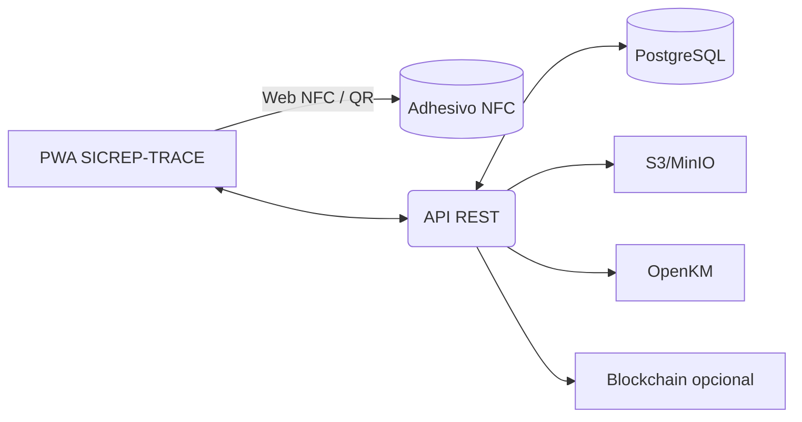

# Sistema de trazabilidad de embalajes con adhesivo NFC (SICREP‑TRACE)

> Blueprint técnico y operativo para certificar trazabilidad REP usando etiquetas NFC en envases/embalajes.

---

## 1) Objetivo
Implementar un sistema integral que asigne a cada embalaje un identificador único (CPS) grabado en un **adhesivo NFC**, permita **registrar peso por material**, controlar **salida → tránsito → recepción en faena**, y emitir **certificados digitales** compatibles con **Ley REP (RETC/DJA)**.

**Resultados esperados**
- Trazabilidad auditable (hash + firma), operando **offline first**.
- Reportes por período/empresa/material/nivel (Primario/Secundario/Terciario).
- Integración con **OpenKM** (respaldo documental) y exportaciones **RETC**.

---

## 2) Arquitectura (alto nivel)
- **PWA Web (Next.js 14 + App Router)**: lectura/grabación NFC, UI de despacho/recepción, pesajes y certificados.
- **API/Backend (Node.js + Prisma + PostgreSQL)**: lógica CPS, eventos de trazabilidad, auditoría e informes.
- **DB**: PostgreSQL (prod) + **IndexedDB** (cache y cola offline).
- **Almacenamiento**: S3/MinIO para fotos, tickets de balanza y PDFs.
- **Firmas y certificados**: FEA (SDK externo) o firma simple + **pdf-lib**.
- **Opcional**: anclaje de hash en blockchain pública (Polygon testnet).
- **DMS**: OpenKM (webhooks para indexar certificados PDF y evidencias).



---

## 3) Modelo de datos (Prisma)

```prisma
model Company {
  id          String  @id @default(cuid())
  rut         String  @unique
  razonSocial String
  retc        String?
  cps         CPS[]
  usuarios    User[]
  createdAt   DateTime @default(now())
}

enum NivelEmb { PRIMARIO SECUNDARIO TERCIARIO }
enum EstadoCPS { ACTIVO EN_TRANSITO ENTREGADO CERRADO }
enum MetodoMedicion { BALANZA DECLARADO ESTIMADO }

a model CPS {
  id        String    @id @default(cuid())
  uidTag    String    @unique   // UID NFC o EPC
  companyId String
  company   Company   @relation(fields: [companyId], references: [id])
  nivel     NivelEmb
  taraGr    Int?
  estado    EstadoCPS @default(ACTIVO)
  createdAt DateTime  @default(now())
  medidas   MedicionPeso[]
  eventos   EventoTraz[]
}

model MedicionPeso {
  id             String   @id @default(cuid())
  cpsId          String
  cps            CPS      @relation(fields: [cpsId], references: [id])
  totalGr        Int
  metodo         MetodoMedicion
  balanzaId      String?
  ubicacion      String?
  lat            Float?
  lng            Float?
  evidenciaUrl   String?
  actorRut       String
  actorNombre    String
  timestamp      DateTime @default(now())
  hashIntegridad String
  lineas         MedicionMaterial[]
}

model MedicionMaterial {
  id         String        @id @default(cuid())
  medicionId String
  medicion   MedicionPeso  @relation(fields: [medicionId], references: [id])
  material   MaterialREP
  pesoGr     Int
}

enum MaterialREP { PAPEL_CARTON PLASTICOS VIDRIO METALES MADERA COMPUESTOS OTROS }

model EventoTraz {
  id        String   @id @default(cuid())
  cpsId     String
  cps       CPS      @relation(fields: [cpsId], references: [id])
  tipo      TipoEvento
  detalle   Json
  timestamp DateTime @default(now())
  actorRut  String
  firmaOk   Boolean  @default(false)
  hash      String
}

enum TipoEvento { ALTA DESPACHO EN_TRANSITO RECEPCION CIERRE }
```

**Reglas de negocio**
- `Σ lineas.pesoGr == totalGr` (tolerancia configurable ±10 g).
- Multiples `MedicionPeso` por CPS (versionado con timestamp + hash).
- `EventoTraz` obligatorio en **ALTA**, **DESPACHO**, **RECEPCION**.

---

## 4) Esquema del adhesivo NFC
**Chip**: NTAG213/215/216 (NDEF)

- **NDEF Record 1 (URI)** → `https://sicrep.cl/trace/{UID}`
- **NDEF Record 2 (Text)** → `CPS:{cpsId}|CHK:{shortHash}`
- **Protecciones**: set `WRITE LOCK` tras grabación; opcional **Password**.

**Visual** (100×60 mm): Logo empresa + QR (misma URL), UID corto, icono “En tránsito” cuando corresponda.

---

## 5) API REST (contratos mínimos)

```http
POST /api/cps                        // crear CPS + asignar UID NFC
PATCH /api/cps/:uid/estado           // ACTIVO|EN_TRANSITO|ENTREGADO|CERRADO

POST /api/cps/:uid/medicion          // registrar pesaje por material
GET  /api/cps/:uid/medicion/ultima

POST /api/cps/:uid/despacho          // genera token de tránsito + evento DESPACHO
POST /api/cps/:uid/recepcion         // valida token + evento RECEPCION (+re-pesaje opcional)

GET  /api/reportes/retc?periodo=2025-01..2025-12
GET  /api/certificados/:uid          // PDF con hash + QR
```

### Ejemplo handler (Next.js, validación Zod)
```ts
// /app/api/cps/[uid]/medicion/route.ts
import { z } from "zod"; import crypto from "crypto"; import { prisma } from "@/lib/prisma";
const Body = z.object({ metodo:z.enum(["BALANZA","DECLARADO","ESTIMADO"]),
  balanzaId:z.string().optional(), ubicacion:z.string().optional(),
  geo:z.object({lat:z.number(), lng:z.number()}).optional(), evidenciaUrl:z.string().url().optional(),
  actorRut:z.string(), actorNombre:z.string(), totalGr:z.number().int().positive(),
  lineas:z.array(z.object({ material:z.enum(["PAPEL_CARTON","PLASTICOS","VIDRIO","METALES","MADERA","COMPUESTOS","OTROS"]), pesoGr:z.number().int().positive()})).min(1)
});
export async function POST(req:Request,{params}:{params:{uid:string}}){
  const uid=params.uid; const b=Body.parse(await req.json());
  const suma=b.lineas.reduce((a,l)=>a+l.pesoGr,0);
  if(Math.abs(suma-b.totalGr)>10) return new Response(JSON.stringify({error:"Suma no coincide"}),{status:422});
  const cps=await prisma.cPS.findUnique({where:{uidTag:uid}}); if(!cps) return new Response(JSON.stringify({error:"CPS no encontrado"}),{status:404});
  const payload=JSON.stringify({uid,...b,ts:Date.now()}); const hash=crypto.createHash("sha256").update(payload).digest("hex");
  const m=await prisma.medicionPeso.create({data:{cpsId:cps.id,totalGr:b.totalGr,metodo:b.metodo as any,balanzaId:b.balanzaId,ubicacion:b.ubicacion,lat:b.geo?.lat,lng:b.geo?.lng,evidenciaUrl:b.evidenciaUrl,actorRut:b.actorRut,actorNombre:b.actorNombre,hashIntegridad:hash,lineas:{create:b.lineas.map(l=>({material:l.material as any,pesoGr:l.pesoGr}))}}});
  return new Response(JSON.stringify({medicionId:m.id,hashIntegridad:hash}),{status:201});
}
```

---

## 6) Flujo operativo

### 6.1 Alta y etiquetado
1. **Nuevo CPS** → generar `cpsId` y reservar **UID NFC**.
2. Grabar NDEF (URI + Text) y **bloquear escritura**.
3. Imprimir PDF de adhesivo (100×60 mm) con QR y datos mínimos.

### 6.2 Pesaje por material (bodega)
- Leer etiqueta (NFC/QR) → UI “**Agregar Pesaje**”.
- Ingresar **líneas por material** (gramos), adjuntar foto/ticket balanza.
- **Hash + firma** (opcional FEA) y guardar.

### 6.3 Despacho a faena (sin GPS)
- **Evento DESPACHO**: genera token de tránsito y cambia estado a `EN_TRANSITO`.
- Transportista puede validar vía NFC/QR; eventos **offline** se guardan en IndexedDB.

### 6.4 Recepción en faena
- Escanear NFC/QR + token → **RECEPCION**; re‑pesaje opcional (nueva `MedicionPeso`).
- Emisión automática de **Certificado PDF** con desglose por material.

---

## 7) PWA Offline‑First
- **IndexedDB + cola**: `{ op, payload, ts }` → `/api/trazabilidad/sync` al reconectar.
- Estrategia **Cache‑first** (Workbox) para `/trace/:uid` y vistas operativas.
- Bloqueo UI ante desalineación de reloj >5 min (consistencia temporal).

---

## 8) Seguridad y auditoría
- JWT por **empresa** + scoping por `companyId` en consultas.
- **RBAC**: Admin, Operador Bodega, Transportista, Receptor Faena, Auditor.
- **Hash** SHA‑256 por medición y por evento; opcional anclaje (tx hash) en cadena.
- Firma **FEA** para certificados/actas (según criticidad).

---

## 9) Reportería y exportaciones
- Dashboard KPI: **Peso por material** (P/S/T), **% en tránsito**, **lead time** despacho→recepción, alertas de límite **300 kg**.
- Exportaciones: **CSV RETC** por periodo/empresa/material/nivel; **ZIP** de evidencias.

---

## 10) Integraciones
- **OpenKM**: webhook `onCertificateCreated` → subir PDF + metadatos CPS.
- **ERP** (opcional): endpoints `/webhooks/erp/oc` y `/webhooks/erp/despacho`.
- **Balanza**: Web Bluetooth/Serial (lectura directa del peso).

---

## 11) Pruebas (checklist)
- Grabación NDEF y bloqueo; lectura en Android (Web NFC) e iOS (app nativa si aplica).
- Validación tolerancia de suma por material.
- Modo offline (vuelos modo avión), colas y reintentos.
- Integridad de hash y verificación de certificado (QR → detalle público).

---

## 12) Despliegue
- **VPS**: Nginx (reverse proxy), **PM2**/Docker, **Let’s Encrypt**.
- **Backups**: DB (diarios), S3 (versionado 7 años), claves de firma en HSM/KMS.

---

## 13) Roadmap
- v1: CPS + NFC + pesaje + despacho/recepción + certificados PDF.
- v1.1: Exportaciones RETC + app terreno mejorada.
- v1.2: Integración OpenKM + balanza Bluetooth/Serial.
- v1.3: Blockchain (anclaje de hash) + marketplace de insumos.

---

## 14) Anexos
**Plantilla NDEF** (NTAG213):
- Record 1: TNF=0x01, RTD=URI, Payload=`https://sicrep.cl/trace/{UID}`
- Record 2: TNF=0x01, RTD=Text, Payload=`CPS:{cpsId}|CHK:{shortHash}`

**Ejemplo CSV RETC**
```
periodo,company_rut,cps_uid,nivel,material,peso_gr,evento,fecha
2025-10,77.957.337-0,04A1B2C3,SECUNDARIO,PAPEL_CARTON,820,RECEPCION,2025-11-04T14:15:00Z
```

